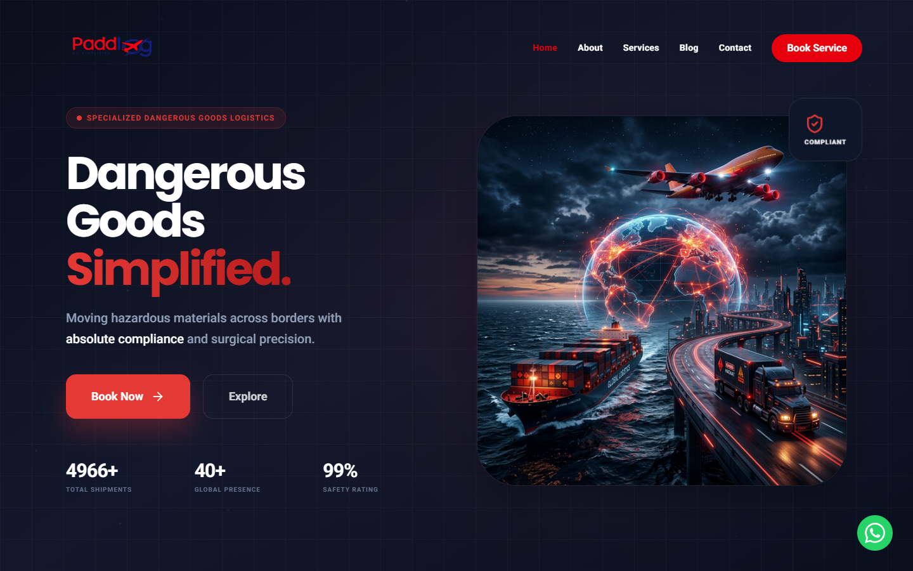
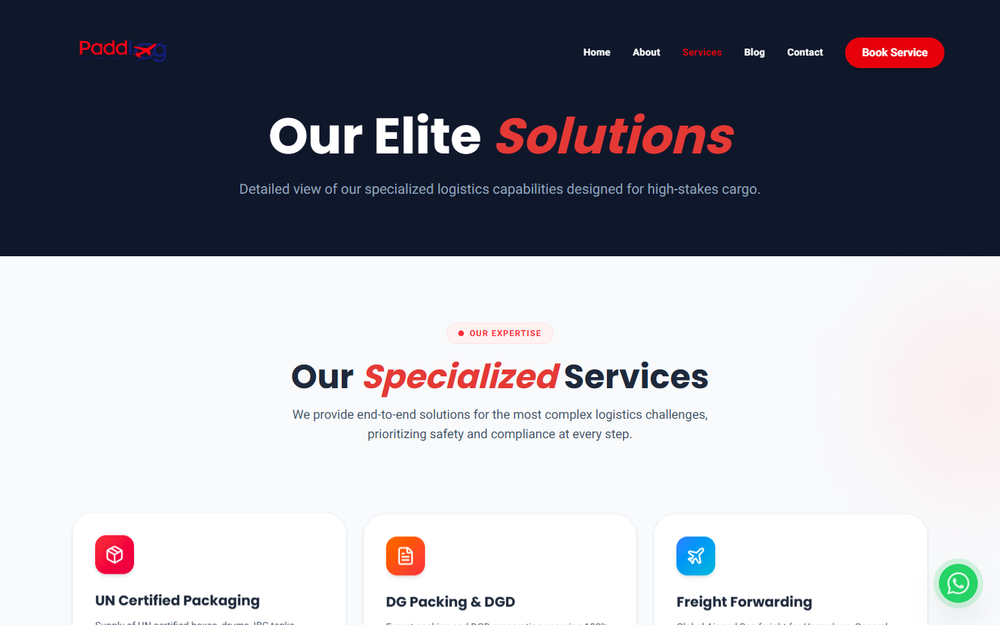
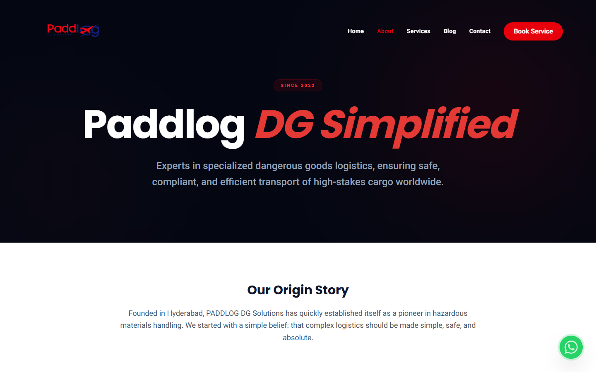
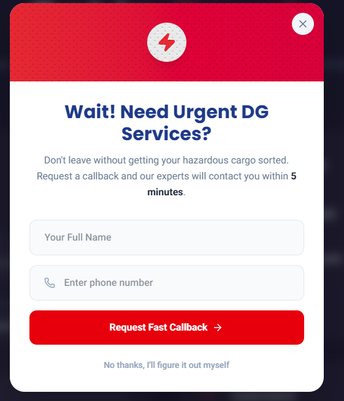
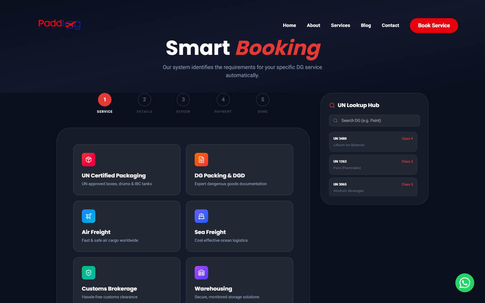
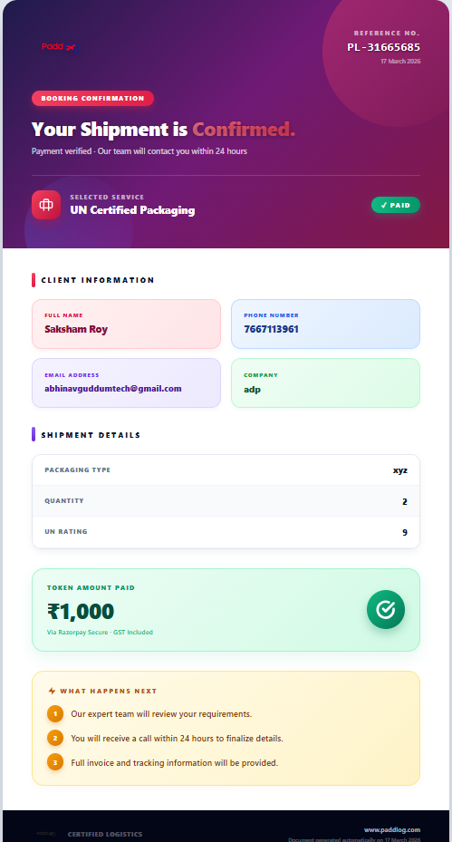
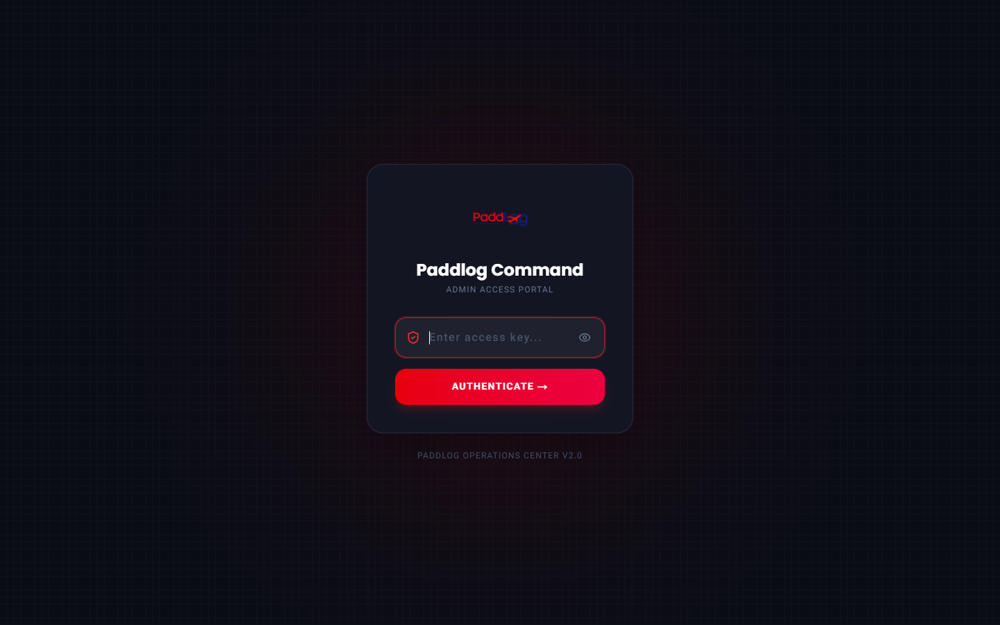
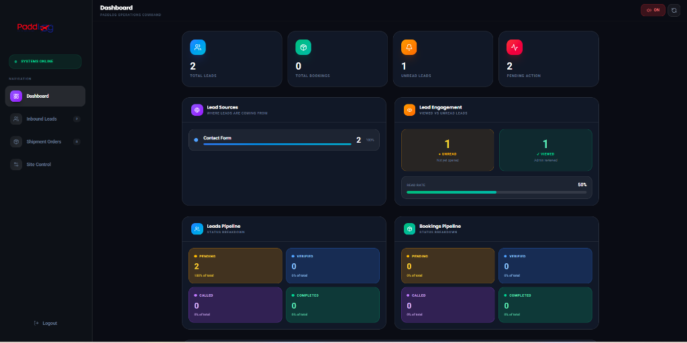

# Paddlog Logistics - Official User Manual

Welcome to the **Paddlog** digital infrastructure handbook. This comprehensive guide will walk you through the various sections of our web portal, including how to book shipments and how to seamlessly manage them using the internal Admin Portal.

---

## 1. Homepage & Navigation

The homepage serves as the main gateway to our logistics network. It features a bold, intuitive design to guide clients immediately to the services they require.

### Key Features of the Homepage:
- **Upper Navigation Bar:** Quick links to "Services", "About Us", and "Resources" to help users easily discover what they need.
- **Hero Call-to-Action:** A large "Book Shipment" button designed to drive immediate client conversion.
- **WhatsApp Integration:** A hovering WhatsApp icon at the bottom right corner ensures instant communication between clients and support agents.
- **Live Maps:** An interactive global connection map emphasizing global shipping capabilities.

---

## 2. Our Services

The Services page details everything that Paddlog provides, carefully segmented to reassure clients of our technical expertise—ranging from UN packaging to complex international freight.

### What Clients Can Find Here:
- Detailed cards showing Air Freight, Ocean Cargo, and Special Dangerous Goods (DG) packaging definitions.
- Highlights of security clearances and RBI/DGCA certifications to build profound trust.
- Quick consultation forms below each specific service type.

---

## 3. About Us

Clients want to know who is behind the logistics operations. The About Us page covers the mission and historical reliability of Paddlog.

### How to use this page:
- Prospective buyers often read this before handing over high-value goods. Keep this section updated with your latest logistics numbers and company milestones.
- Leadership and network partner logos emphasize Paddlog's legitimacy globally.

---

## 4. Fast Callback / Exit Intent Feature

To maximize lead capturing, Paddlog includes an **Urgent DG Services** callback popup. This triggers intelligently when a user attempts to leave the website or waits for a duration without taking action.

### Features & Workflow:
- **Instant Trigger:** Asks for full name and phone number.
- **Fast Action Promise:** Reassures the client that our expert team will contact them within *5 minutes*.
- **Direct to Database:** Any submission from this popup directly injects a new lead into the Admin Dashboard under the "Contact Form / Exit Popup" sources.

---

## 5. Booking a Shipment (For Clients)

The core transaction engine. When a client clicks **Book Shipment**, they are directed to a highly secure and beautifully structured multi-step portal.

### The Booking Flow Explained:
- **Step 1: Service Selection:** Client chooses standard shipping vs. UN Certified specialized packaging.
- **Step 2: Client Information:** Input of name, email, contact, and company details.
- **Step 3: Cargo Details:** Origin, destination, exact weight, and classification.
- **Step 4: Secure Payment:** Integration with a robust, glassmorphic payment portal powered securely by Razorpay.

---

## 6. Official PDF Booking Receipt

When a client successfully completes their payment and their shipment is verified, the system generates a dynamic, highly-styled PDF receipt. This acts as a professional physical handover and confirmation document.

### Key Specifications of the PDF Receipt:
- **Client Information:** Logs the customer's Full Name, Phone Number, Email Address, and Company.
- **Shipment Details:** Logs exact parameters such as "UN Rating" and "Packaging Type" required for chemical/dangerous goods.
- **Token Payment Verification:** Bright green secure verification badge showing the exact token amount paid (inclusive of GST) via Razorpay.
- **Gradient Aesthetic:** Features a vibrant, multi-layered color gradient with the Paddlog brand logo, and an auto-generated unique Reference Number (e.g., `PL-31665685`).
- **Next Steps Pipeline:** Explains to the user exactly what will happen next (review, call within 24 hours, invoice sharing).

---

## 7. Admin Access Portal (Login)

To efficiently manage all incoming inquiries and cargo, authorized personnel use the Paddlog Command Center. 

### Accessing the Portal:
- **URL Route:** Navigate directly to `/admin` via the browser.
- **Access Key required:** Ensure you possess the correct confidential password to enter. The system performs secure backend verification.
  - **The current Master Password is:** `Paddlog@2024`

---

## 8. Admin Access Portal (Dashboard)

The dashboard gives 360-degree visibility over operations.

### Working with the Dashboard Interface:
- **Audio-Visual Alerts:** Immediate alert tones loop continuously when a new lead surfaces in real-time.
- **Lead Engagement Tracking:** Shows exactly how many leads are "Unread" versus "Viewed".
- **Real-Time Funnel (Bookings & Leads Pipeline):** Split view tracking the percentage (%) of leads that are *Pending*, *Verified*, *Called*, or *Completed*. Total shipments are separately summarized to easily measure conversions.
- **Quick Status Switches:** You can click on any lead and quickly hit a status button to mark them completed or verified.
- **Exporting Data:** A seamless direct export is available to push CSV reports whenever requested by higher management.

---

## Need Further Support?
For technical maintenance, API updates, or modifying text contents on the site, refer directly to your designated infrastructure specialist.

*Paddlog DG Solutions • Confidential Operations Manual*
