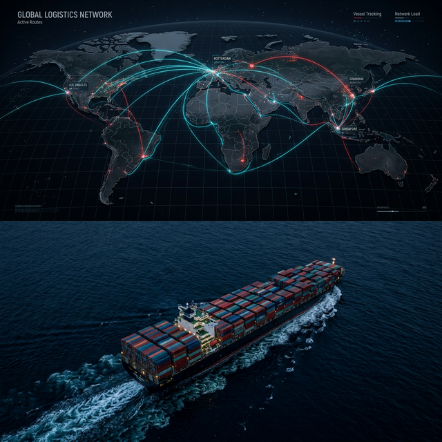

# Paddlog DG Solutions Website – User Manual

Version: 1.0  
Last updated: March 17, 2026

## Who this guide is for

This manual is written in simple English for:

- Customers/visitors who want to explore services, book a service, or contact the team.
- The internal team who manages leads and bookings in the Admin Dashboard (see the last section).

## Quick navigation (website)

### Top menu (Navbar)

You can use the top menu to open:

- Home
- About
- Services
- Blog
- Contact
- Book Service (button)

### Mobile navigation

On small screens:

- Tap the menu icon (☰) to open links.
- Tap the close icon (✕) to close the menu.

### Floating buttons (bottom-right)

On most pages you will also see:

- WhatsApp button: opens WhatsApp chat with the team.
- Back-to-top button: appears after you scroll down; taps scroll you to the top.

## Home page (/) – what you will see

The Home page is a single long page with multiple sections. Common sections include:

- Hero: main message + quick buttons (Book Now / Explore).
- Services: service cards; each card opens a service detail page.
- DG Classes: quick overview of the 9 classes of Dangerous Goods.
- Process: the 5-step workflow (Inquiry → Delivery).
- International Reach: a global map/network section.
- Testimonials and FAQ.
- Call-to-action: quick buttons to Book Service or Contact Experts.

## International Reach (Global Network)

This section highlights the global network and shows quick stats like Countries/Partners/Uplink.

## Services

### Services list (/services)

Use this page to browse all services.

- Scroll through the service cards.
- Click **Book this service** to open the detailed page for that service.

### Service detail pages (/services/<service>)

Each service page typically includes:

- Overview and detailed explanation.
- Key capabilities (feature list).
- Compliance/regulations notes (where applicable).
- Buttons:
  - **Book Service** → opens `/book`
  - **Contact Experts** → opens `/contact`

## Book a service (/book)

The booking page is a step-by-step form. It helps you share the correct information for faster processing.

### Step 1: Choose a service

- Select the service type you need (example: DG Packing & DGD, Air Freight, Customs, etc.).

### Step 2: Fill your details

- Enter your name, email, and phone number (required).
- Add shipment details as needed (origin, destination, weight, UN number, packing group, etc.).

Tip: For Dangerous Goods shipments, keep your MSDS/SDS and UN number ready. Accurate details prevent delays and rejections.

### Step 3: Review

- Verify the details on the review screen.
- Go back if you need to correct anything.

### Step 4: Payment (Razorpay)

- Complete the secure payment to confirm the booking.
- If payment fails, try again or contact support and share the Payment ID shown by the gateway.

### Step 5: Confirmation + PDF

- After a successful payment, you will see a confirmation screen.
- Use the **Download Booking Confirmation PDF** button to save a PDF for your records.

Extra tools:

- UN Lookup Hub: a small search panel that helps you find common UN numbers (quick reference).

## Contact page (/contact)

Use this page if you want a quote, expert advice, or support.

### Send an inquiry (form)

1. Fill your details (name, email, phone).
2. Select a service type (optional, helps routing).
3. Write a short message with your requirement.
4. Tap **Transmit Inquiry**.

If it is submitted successfully, you will see a success message like **Message Received!**

### Quick support options

Contact details may vary by department. If you are unsure, use the Contact page for the latest info.

- WhatsApp: use the chat button on the page (or the floating WhatsApp icon).
- Phone and email: shown on the Contact page and in the site footer.

## Blog (/blog)

The Blog page contains learning articles (example topics: packaging, regulations, logistics, safety).

- Use category buttons to filter posts.
- Click any post card to open the full article in an overlay.
- Click outside the article (or press **Close**) to return to the list.

## Urgent Callback popup (Exit-intent)

Sometimes you may see a popup message like **“Wait! Need Urgent DG Services?”**

Why it appears:

- Desktop: when your cursor moves near the top (exit intent).
- Mobile: when you scroll up quickly.
- Also: it may auto-open after some time to help visitors request support.

What to do:

- Enter your name and phone number.
- Tap **Request Fast Callback**.
- Or close it using the **X** button.

## Privacy and Terms

- Privacy Policy: `/privacy`
- Terms of Service: `/terms`

## Troubleshooting (common issues)

- Page not loading: refresh the page and check your internet connection.
- Form not submitting: confirm all required fields are filled, then try again.
- No response yet: use WhatsApp or call the support number shown on the Contact page.
- Payment issues: try again or contact support with the Payment ID from the gateway.

---

# Admin Dashboard (Internal)

This section is for the internal Paddlog team only.

## Open the dashboard

URL: `/admin`

## Login

- Enter the Admin Access Key.
- After login, the browser may remember the session on the same device.

## Main tabs

- Overview: quick stats and alerts.
- Leads: messages from Contact form and the urgent callback popup.
- Bookings: paid bookings from the Book Service flow.
- Settings: section visibility (show/hide Home page sections).

## Leads & bookings actions

Common actions available in lists/details:

- View details (eye icon)
- Export PDF (download icon)
- Delete (trash icon)
- Update status (Pending / Verified / Called / Completed) where available
